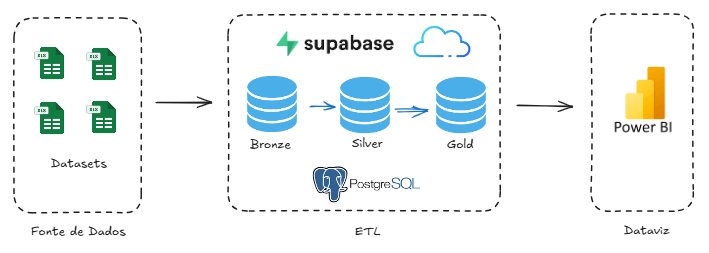
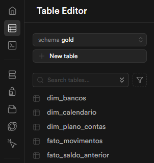
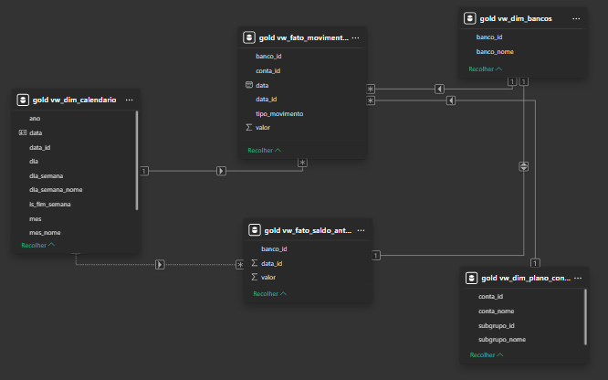
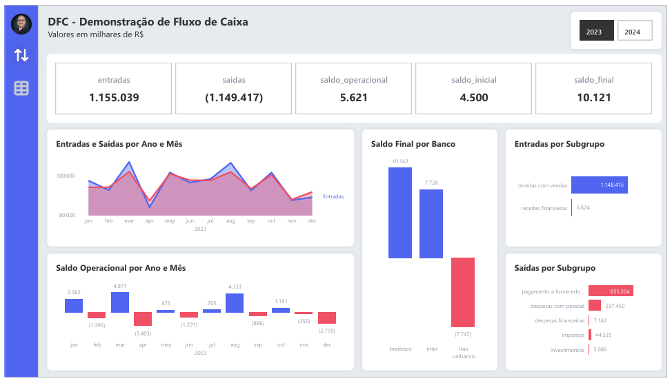
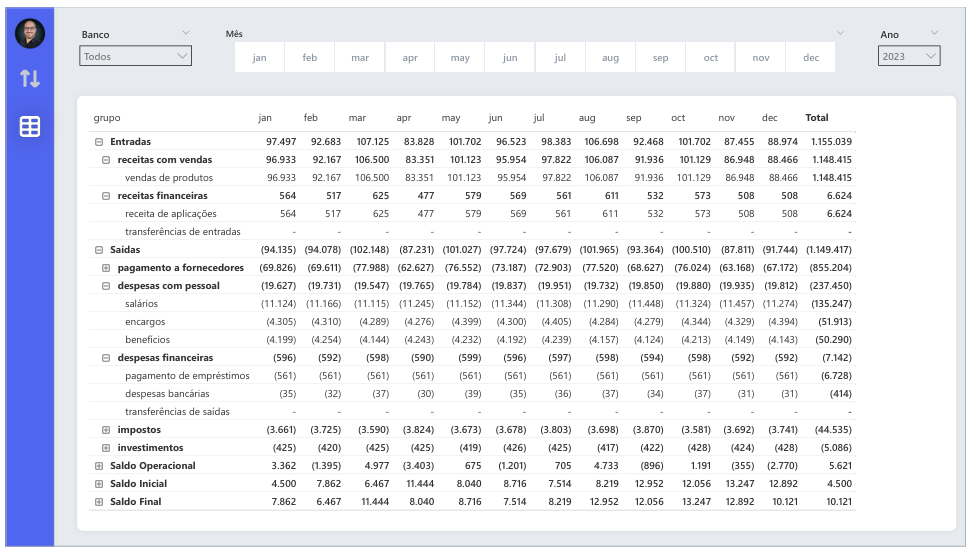

# Projeto Demonstração de Fluxo de Caixa (DFC) – Versão 3.0  

---

## 📌 Sumário
1. Evolução da Arquitetura até a Versão 3.0  
2. Arquitetura do Projeto | Versão 3.0  
3. Stack Tecnológica  
4. Desenvolvimento
5. Caso Real de Data Quality  
6. Boas Práticas Consolidadas  
7. Conclusão  

---

# 🚀 1. Evolução da Arquitetura até a Versão 3.0

A versão **3.0** do projeto Demonstração de Fluxo de Caixa (DFC) representa uma evolução significativa na maturidade da arquitetura de dados.

Se na versão 2.0 o foco foi a migração do ETL para Python + PostgreSQL, agora o projeto evolui para:

- ☁️ Banco de dados em nuvem (**Supabase – PostgreSQL gerenciado**)  
- 🧱 Arquitetura **Medallion (Bronze / Silver / Gold)**  
- 🔄 Transformações centralizadas em **SQL**
- 📊 Consumo analítico via **Power BI**

Fluxo atual:  
Excel ➝ Supabase (Bronze) ➝ SQL Transformations (Silver) ➝ Camada Gold (DW) ➝ Power BI  

A versão 3.0 reforça princípios de:

- Governança de Dados
- Imutabilidade (Dado original permanece intacto. Camada Bronze deve representar fielmente a ingestão)
- Reprocessamento controlado
- Validação quantitativa por camada
- Engenharia de Dados orientada à confiabilidade

---

# 🏗 2. Arquitetura do Projeto | Versão 3.0

A arquitetura segue o padrão **Medallion Architecture**:  

## 🔹 Bronze (Raw Layer)
- Dados ingeridos no formato mais próximo possível da origem.
- Sem regras de negócio.
- Sem enriquecimento.
- Camada bruta dos dados.

## 🔹 Silver (Clean Layer)
- Tratamento de tipos de dados.
- Padronização.
- Correção estrutural.
- Regras de negócio iniciais.

## 🔹 Gold (Business Layer)
- Modelagem dimensional.
- Tabelas Fato e Dimensão.
- Estrutura pronta para consumo analítico.
- Fonte única da verdade para o Power BI.

---

# 💻 3. Stack Tecnológica

- `Supabase (PostgreSQL Cloud)` – Banco de dados na nuvem
- `SQL` – Transformações e modelagem
- `Power BI` – Visualização e análise
- `Git & GitHub` – Versionamento
- `VS Code` – Desenvolvimento
- `Excel` – Fonte original dos dados financeiros

---

# 🎯 4. Desenvolvimento

- Ingestão de dados no supabase.com (upload dos datasets na plataforma)

- [Passos no supabase para criação da camada bronze.](supabase_queries/1_bronze_tables.sql)
- [Passos no supabase para criação da camada silver.](supabase_queries/2_silver_tables.sql)
- [Passos no supabase para criação da camada gold.](supabase_queries/3_gold_tables.sql)  

- Tabelas da Camada GOLD criadas
  

- Modelagem de Dados | Camada GOLD
  

- Desenvolvimento de VIEWS para consumo no Power BI | Camada GOLD
vw_dim_bancos  
vw_dim_plano_contas  
vw_dim_calendario  
vw_fato_saldo_anterior  
vw_fato_movimentos  

- Dashboards em Power BI | Dataviz
02 modelos foram desenvolvidos para o cliente:  
  

 